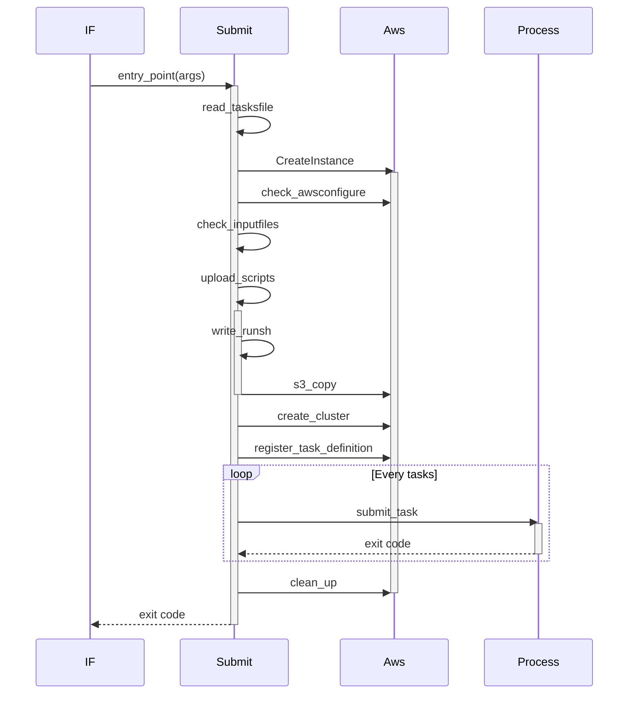
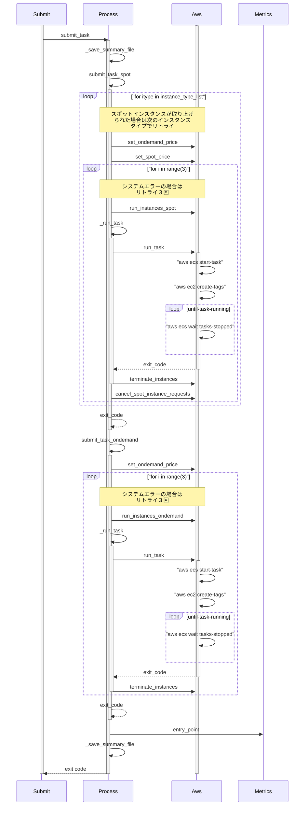
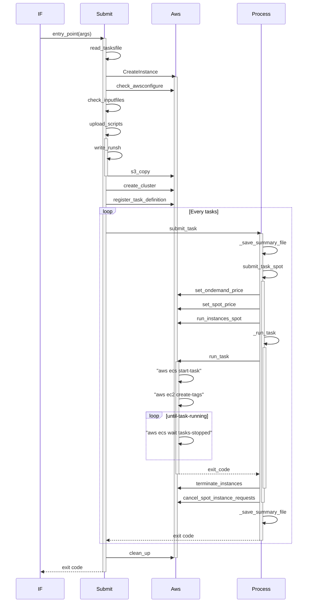

view with https://mermaidjs.github.io/mermaid-live-editor

```mermaid
sequenceDiagram

IF->>Submit: entry_point(args)
activate Submit
  Submit->>Submit: read_tasksfile
  Submit ->> Aws: CreateInstance
  activate Aws
    Submit ->> Aws: check_awsconfigure
    Submit ->> Submit: check_inputfiles
    
    Submit ->>+Submit: upload_scripts
      Submit ->> Submit: write_runsh
    Submit ->> -Aws: s3_copy
    Submit ->> Aws: create_cluster
    Submit ->> Aws: register_task_definition
    
    loop Every tasks
      Submit ->> Process: submit_task
      activate Process
        Process -->> Submit: exit code
      deactivate Process
    end
    
    Submit ->> Aws: clean_up
  deactivate Aws
  Submit -->> IF: exit code
deactivate Submit
```

```mermaid
sequenceDiagram

activate Submit
activate Aws
  Submit ->> Process: submit_task
  activate Process
    Process ->> Process: _save_summary_file

    Process ->> +Process: submit_task_spot
      loop "for itype in instance_type_list"
        Note over Process,Aws: スポットインスタンスが取り上げ<br>られた場合は次のインスタンス<br>タイプでリトライ
        Process ->> Aws: set_ondemand_price
        Process ->> Aws: set_spot_price
        loop "for i in range(3)"
          Note over Process, Aws: システムエラーの場合は<br>リトライ３回
          Process ->> Aws: run_instances_spot
          Process ->> +Process: _run_task
            Process ->> +Aws:  run_task
              Aws ->> Aws: "aws ecs start-task"
              Aws ->> Aws: "aws ec2 create-tags"
              loop until-task-running
                Aws ->> Aws: "aws ecs wait tasks-stopped"
              end
            Aws -->> -Process: exit_code
          Process ->> -Aws:  terminate_instances
          Process ->> Aws: cancel_spot_instance_requests
        end
      end
    Process -->> -Process: exit_code

    Process ->> +Process: submit_task_ondemand
      Process ->> Aws: set_ondemand_price
      loop "for i in range(3)"
        Note over Process, Aws: システムエラーの場合は<br>リトライ３回
        Process ->> Aws: run_instances_ondemand
        Process ->> +Process: _run_task
          Process ->> +Aws:  run_task
            Aws ->> Aws: "aws ecs start-task"
            Aws ->> Aws: "aws ec2 create-tags"
            loop until-task-running
              Aws ->> Aws: "aws ecs wait tasks-stopped"
            end
          Aws -->> -Process: exit_code
        Process ->> -Aws:  terminate_instances
      end
    Process -->> -Process: exit_code

    Process ->> Metrics: entry_point
    Process ->> Process: _save_summary_file
    Process -->> Submit: exit code
  deactivate Process
deactivate Aws
deactivate Submit
```

```mermaid
sequenceDiagram

IF->>Submit: entry_point(args)
activate Submit
  Submit ->> Submit: read_tasksfile
  Submit ->> Aws: CreateInstance
  activate Aws
    Submit ->> Aws: check_awsconfigure
    Submit ->> Submit: check_inputfiles
    Submit ->>+Submit: upload_scripts
      Submit ->> Submit: write_runsh
    Submit ->> -Aws: s3_copy
    Submit ->> Aws: create_cluster
    Submit ->> Aws: register_task_definition
    
    loop Every tasks
      Submit ->> Process: submit_task
      activate Process
        Process ->> Process: _save_summary_file
        Process ->> +Process: submit_task_spot
          Process ->> Aws: set_ondemand_price
          Process ->> Aws: set_spot_price
          Process ->> Aws: run_instances_spot
          
          Process ->> +Process: _run_task
            Process ->> +Aws:  run_task
              Aws ->> Aws: "aws ecs start-task"
              Aws ->> Aws: "aws ec2 create-tags"
              loop until-task-running
                Aws ->> Aws: "aws ecs wait tasks-stopped"
              end
            Aws -->> -Process: exit_code
          Process ->> -Aws:  terminate_instances
        
        Process ->> -Aws: cancel_spot_instance_requests
        Process ->> Process: _save_summary_file
        Process -->> Submit: exit code
      deactivate Process
    end
    
    Submit ->> Aws: clean_up
  deactivate Aws
  
  Submit -->> IF: exit code
deactivate Submit
```

